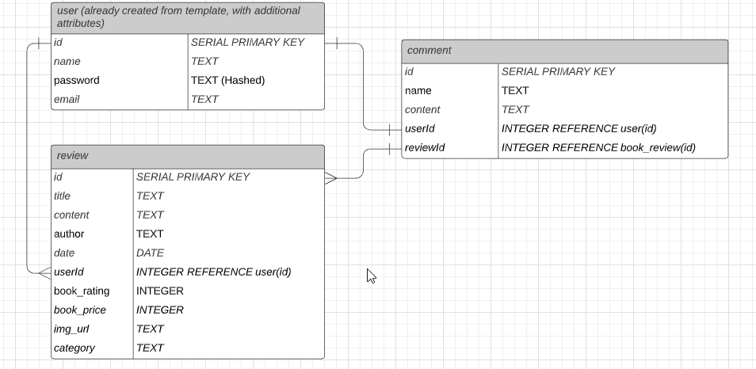
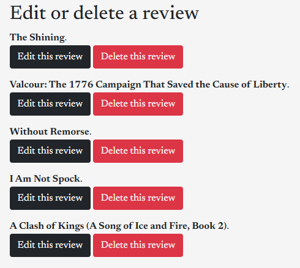

# GoodBoox
GoodBoox is a multi author Book Review site/blog, inspired by [Goodreads](https://www.goodreads.com/).

# Project Purpose
This project was meant to demonstrate the use of full stack technologies, including:
* Node
* Express JS
* Postgres (For database)
* Sequelize (For ORM to Postgres)
* Axios (For API Calls)
* Bootstrap (For easier styling management)
* Passport (for Authentication)
* HTML
* CSS
* Javascript

## Usage
* **Without Account**
Visitors can view any review and comment on them without creating an account.

* **With Account**
Registered visitors can create their own reviews, and edit and delete any review.

## Links Table
| Page | Description |
| ----------- | ----------- |
| [goodboox main page](https://good-boox.herokuapp.com/) | Homepage with a list of reviews, and the latest NYT Best Sellers in multiple categories |
| [Signup Page](https://good-boox.herokuapp.com/auth/signup) | Sign up for access to more features on the site |
| [Login Page](https://good-boox.herokuapp.com/auth/login) | Login to access your own account |
| [New Review](https://good-boox.herokuapp.com/book/new) | Create a new review (logged in) |
| [Edit Review Page](https://good-boox.herokuapp.com/book/edit)| Main page for editing and deleting reviews (logged in) |
| [Profile page](https://good-boox.herokuapp.com/profile) | Your profile page (logged in)  | 

## Routing Table
| Verb | URL | Action (CRUD) | Description
| ------- | ------- | ------- | ------- |
| GET | / | Index (Read) | The homepage with list of reviews and links. | 
| GET | /book/new | New (Read) | Show a form to create a book review. |
| POST | / | Create (Create) | Creates new book review using POST payload data. Redirects to homepage. | 
| GET | /signup/ | New (Read) | Shows user a form to create a new account. |
| POST | /signup/ | Create (Create) | Creates a new user account using POST payload data. Redirects to homepage. |
| GET | /login | Login (Read) | Shows user a login form with username and password fields |
| POST | /login | Login (Read) | Authenticates the user and redirects to homepage. |
| GET | /book/review/:id | Show (Read) | Shows a book review based on ID of book. | 
| GET | /book/edit/:id | Edit (Read) | Shows a form to edit based on the ID of book. |
| PUT | /book/edit/:id | Update (Update) | Updates data for specific book using POST payload data. Redirects to book's review based on ID.|
| GET | /profile | Get (Read) | Shows logged in user their profile information including full name, ID number and email address
| DELETE | /book/edit/:id | Delete (Delete) | Deletes a specific review based on the ID parameter.
| ------- | ------- | ------- | ------- |

# Entity Relationship Diagram


# Screenshots of pages
### **Index Page - Reviews**


### **Index Page - NYT Api Results**


### **Edit or Delete reviews as a logged in user**


### **Editing a specific review as a logged in user**


# How it works (Code)
## Initial Index page code
When visitor arrives at the main page, Sequelize will find all reviews. After that is fulfilled, Axios calls the New York Times API to retrieve an Overview list. I separated 4 categories (which are their own object in the API) and pass on that data to the Index EJS page for rendering purposes.
```javascript
app.get('/', async (req, res) => {
    try {
      const reviews = await db.review.findAll()
      const response = await axios.get(`https://api.nytimes.com/svc/books/v3/lists/overview.json?api-key=${API_KEY}`)
      const fictionData = response.data.results.lists[0].books // list of Fiction best sellers
      const nonfictionData = response.data.results.lists[1].books // Non fiction list best sellers
      const pictureBookData = response.data.results.lists[8].books // Childrens Picture Book list best sellers
      const childrensSeriesData = response.data.results.lists[9].books // Childrens Series list best sellers
      const bestSellersDate = response.data.results.bestsellers_date
      // Render page
      res.render('index', {reviews,bestSellersDate,fictionData,nonfictionData,pictureBookData,childrensSeriesData})
    } catch (err) {
      console.log(err)
    }
});
```

## New Review page
New reviews require finding the review based on the ID paramter passed into the URL. The review is tied to the logged in user. Form field values are grabbed using  **req.body.params**.

### **Route for new page**
```javascript
router.post('/new', isLoggedIn, (req,res) =>{
  const {id, name} = req.user.get()
  db.user.findOne({
    where: {name: name},
    include:[db.review]
  }).then (userName =>{ db.review.create({
    title:req.body.title,
    content:req.body.content,
    book_rating:req.body.book_rating,
    book_price:req.body.book_price,
    img_url:req.body.img_url,
    category:req.body.category,
    author:req.body.author,
    userId: req.user.id
    })
    }).then(post =>{
      req.flash('success','Review Created Successfully!')
      res.redirect('/')
    })
})
```
### **New Page EJS**
```html
<div class="container review">
<p class="h4">Create a new book review</p>

<form action="/book/new" method="POST">

    <div class="form-group">
    <label for="book-title">Book Title *</label>
    <input type="text" class="form-control w-50 mb-3" id="book-title" name="title" placeholder="Enter a Book Title" required>
    <label for="author">Author of Book *</label>
    <input type="text" class="form-control w-50 mb-3" id="author" name="author" placeholder="Enter Author Name" required>
    <label for="category">Category *</label>
    <input type="text" class="form-control w-50 mb-3" id="category" name="category" placeholder="Enter a Category" required>
    <label for="content">Review *</label>
    <textarea name="content" class="form-control w-50 mb-3" id="content" cols="90" rows="10" placeholder="Enter your review" required></textarea>
    </div>

    <div class="form-group">
    <label for="book-price">Retail Price *</label>
    <input type="number" class="form-control w-25 mb-3" id="book-price" name="book_price" placeholder="Enter Book Price" required>
    <label for="img-url">Image Address (full URL) *</label>
    <input type="url" class="form-control w-50 mb-3" id="img-url" placeholder="Enter image URL" name="img_url" required>
    <div class="rating">
    <p>Rating (1 = Horrible, 5 = Excellent)</p>
    <input type="radio" class="form-check-input" id="1" name="book_rating" value=1 required>
    <label for="1">1</label>
    <input type="radio" class="form-check-input" id="2" name="book_rating" value=2 required>
    <label for="2">2</label>
    <input type="radio" class="form-check-input" id="3" name="book_rating" value=3 required>
    <label for="3">3</label>
    <input type="radio" class="form-check-input" id="4" name="book_rating" value=4 required>
    <label for="4">4</label>
    <input type="radio" class="form-check-input" id="5" name="book_rating" value=5 required>
    <label for="5">5</label>
    </div>
    </div>
<br \>
<input type="submit" value="Submit" class="btn btn-warning">
<br><br>
<p>* required</p>
</form>
</div>
```
## Edit Review Main Page
All reviews are presented on one page at this time. Registered users can edit specific reviews or delete them.

### **Edit Main Page Route***
```javascript
  // EDIT Page index to see all books and edit links.
router.get('/edit', isLoggedIn, (req,res) =>{
  // res.send('Edit index page')
  db.review.findAll()
  .then(reviews =>{
    res.render('reviews/editpage', {reviews})
  })
})
```
### **Edit Review Main Page EJS**
```html
<div class="container review">
    <h2>Edit or delete a review</h2>
    <% reviews.forEach((review, index) => { %>
        <div class="edit-container">
            <li style="margin-bottom: 15px;"><span style="font-weight: 700;"><%= review.title %></span>.
                <br>
                <div class="btn btn-dark" style="display: inline-block;"> <a href="/book/edit/<%=review.id%>" style="color: rgb(255, 255, 255); text-decoration: none;">Edit this review </a></div> 
            <form method="POST" action="/book/edit/<%=review.id%>/?_method=DELETE" style="display: inline-block;">
                <input type="submit" value="Delete this review" class="btn btn-danger">
            </form>
            </li>  
        </div>
    <% }); %> 
</div>

```

## Edit Review Page
The page to edit a review involves finding a review based on the parameter id passed into the URL. On the related EJS page, each input field is then repopulated with the book's data from the review.

### **Edit review route**
```javascript
router.get('/edit/:id', isLoggedIn, (req,res) =>{
  const bookId = req.params.id
  db.review.findOne({
    where: {id:bookId},
    include:[db.user]
  }).then (bookFound =>{
    console.log(bookFound)
    res.render('reviews/editform.ejs', {bookFound})
  })
})
```

### **Edit review EJS page**
```HTML
<div class="container center-block review">
<p class="h4">Edit the "<%= bookFound.title %>""  book review</p>
<form action="/book/edit/<%= bookFound.id %>/?_method=PUT" method="POST">
    <div class="form-group">
        <label for="book-title">Book Title *</label>
        <input type="text" class="form-control w-50 mb-3"  id="book-title" name="title" value="<%= bookFound.title %>" required>
        <label for="author">Author of Book *</label>
        <input type="text" class="form-control w-50 mb-3"  id="author" name="author" placeholder="Enter Author Name" value="<%= bookFound.author %>" required>
        <label for="category">Category *</label>
        <input type="text" class="form-control w-50 mb-3"  id="category" name="category" placeholder="Enter a Category" value="<%= bookFound.category %>" required><input>
        <label for="content">Review *</label>
        <textarea name="content" class="form-control w-50 mb-3"  id="content" cols="90" rows="10" placeholder="Enter your review" required><%= bookFound.content %> </textarea>
    </div>
    <div class="form-group">
        <label for="book-price">Retail Price *</label>
        <input type="number" class="form-control w-25 mb-3"  id="book-price" name="book_price" placeholder="Enter Book Price" value="<%= bookFound.book_price %>" required>
        <label for="img-url">Image Address (full URL)</label>
        <input type="url" class="form-control w-50 mb-3"  id="img-url" placeholder="Enter image URL" value="<%= bookFound.img_url %>" name="img_url" required>
        <br><br>
        <div class="rating">
            <p>Rating (1 = Horrible, 5 = Excellent)</p>
            <input type="radio" class="form-check-input"  id="1" name="book_rating" <% if (bookFound.book_rating == 1) { %>
                checked
            <% } %> value=1 required >
            <label for="1">1</label>
            <input type="radio" class="form-check-input"  id="2" name="book_rating" <% if (bookFound.book_rating == 2) { %>
                checked
            <% } %> value=2 required>
            <label for="2">2</label>
            <input type="radio" class="form-check-input"  id="3" name="book_rating" <% if (bookFound.book_rating == 3) { %>
                checked
            <% } %> value=3 required>
            <label for="3">3</label>
            <input type="radio" class="form-check-input"  id="4" name="book_rating" <% if (bookFound.book_rating == 4) { %>
                checked
            <% } %> value=4 required>
            <label for="4">4</label>
            <input type="radio" class="form-check-input"  id="5" name="book_rating" <% if (bookFound.book_rating == 5) { %>
                checked
            <% } %> value=5 required>
            <label for="5">5</label>
        </div>
    </div>
<br \>
<input type="submit" value="Submit" class="btn btn-warning">
<br><br>
<p>* required</p>
</form>
</div>

```

# Models
Write models table here

---
# Installation Requirements
To run the app locally, you will need the following:
* API Key. Sign up for the New York Times API [here](https://developer.nytimes.com/)

---


# Future Considerations
The site sort of a "wild wild west" right now, which with time, can become chaotic. Here are a couple of challenges I'd like to fix:
1. Any registered member can edit and delete someone else's reviews.
    * Find a way to only show that register user's reviews using table associations.
2. Add an anti-spam module for the comments section.
    * I have done this in the past, but with Wordpress, which involved a plugin. I must find a way to at least prevent bots from comments in the same manner.
3. Limit amount of reviews that show up on the main page.
    * I believe using a limit in my query would fix this. Figuring out the logic on how to display a "Next Page" with X amount of reviews shouldn't be too difficult.
4. Add categories to the page
    * I already have the categories in the database. Displaying them in a meaninful way is what I need to do.
5. Associating a book review with multiple categories
    * A book can belong to many categories/genres. For simplicities sake, I left it at 1 category for now.
6. Add a profile picture for each user
    * I'd like to use Cloudinary to enable this functionality in the future.
7. Search Functionality
    * Be able to search by criteria like Author, Category, User Name, etc
8. Differentiating account types, such as reviewer vs admin
    * This would help prevent just allowing anyone to edit and delete any review.
9. Deleting comments easily by adding a button next to the comment
    * I have a dbTest function that does this currently.

# Credits
## Helpful Links
*Stack Overflow:* 
Helped me solve the issue retrieving data back from the DB using EJS. Applied same logic from PHP and it worked.
[selected value get from db into dropdown select box option using php mysql error](https://stackoverflow.com/questions/18733545/selected-value-get-from-db-into-dropdown-select-box-option-using-php-mysql-error/39070055)

## API Used
I used the [New York Times API](https://developer.nytimes.com/) to get the latest "Best Sellers" for books in multiple categories. Thankfully, the data was not as nested or difficult to retrieve what I was looking for.

## People ##
I wouldn't have been able to complete this project without the help of my instructor and members of my "pod" during the project week for this assignment at General Assembly. Seeing how I wasn't the only one struggling with these concepts was in itself a motivator. We were all in the same boat, yet found our way to shore by combining skills and knowledge. (Ask for permission to write names). 
