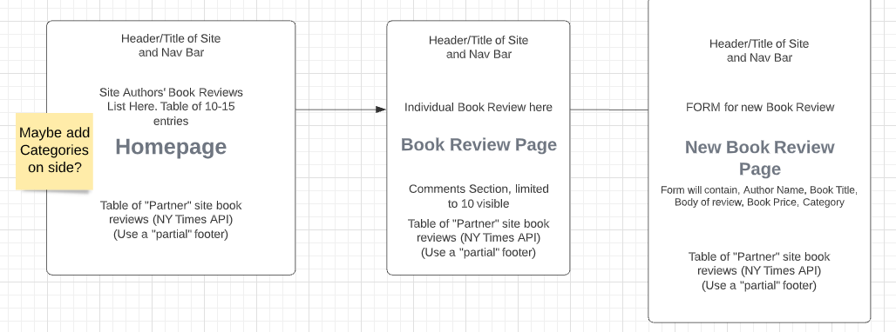

# Proposal
Requirements for the weekend

`1` An application name / concept

 Book review blog called "Good Boox", which will have multiple authors. It is inspired by GoodReads.

`2` A repo for your project 2 (built from express_auth template)

Visit **[Good Boox](https://github.com/mauricechevez/GoodBoox)** here.

`3` Wireframe for your app - (Lucidchart)

`4` An ERD with two models (minimum) > User + 1 Resource (one to many) - (Lucidchart)

- One : One
    - A comment belongs to one article.
- One : Many
    - A review can have many comments.
    - An author can have many reviews.

`5` Create (3-5) User Stories for the base user experience - ( [Reference] (https://revelry.co/resources/
development/user-stories-that-dont-suck/) )

    - (As a reader) I want to see a list of current book reviews.
    - I want to be able to create my own book reviews, and add a picture of the book's cover and show current retail price.
    - I want to be able to comment on reviews.
    - (As a reader) I want to see a list of categories of books.

`6` Resource's Restful Routing table ( [Readme] (https://romebell.gitbook.io/sei-412/node-express/00readme-1/01intro-to-express/00readme#restful-routing) )

| Verb | URL | Action (CRUD) | Description
| ------- | ------- | ------- | ------- |
| GET | / | Index (Read) | The homepage with list of reviews and links. | 
| GET | /book/new | New (Read) | Show a form to create a book review. |
| POST | / | Create (Create) | Creates new book review using POST payload data. Redirects to homepage. | 
| GET | /signup/ | New (Read) | Shows user a form to create a new account. |
| POST | /signup/ | Create (Create) | Creates a new user account using POST payload data. Redirects to homepage. |
| GET | /login | Login (Read) | Shows user a login form with username and password fields |
| POST | /login | Login (Read) | Authenticates the user and redirects to homepage. |
| GET | /book/review/:id | Show (Read) | Shows a book review based on ID of book. | 
| GET | /book/edit/:id | Edit (Read) | Shows a form to edit based on the ID of book. |
| PUT | /book/edit/:id | Update (Update) | Updates data for specific book using POST payload data. Redirects to book's review based on ID.|
| GET | /book/categories/ | Show (Read) | Shows a list of categories of books. |
| GET | /book/categories/:category | Show (Read) | Shows the books belonging to selected category.
| ------- | ------- | ------- | ------- |

`7` Find API and test to see if you can get data ( *be able to print data in the console using Axios, Node-Fetch, and/or Postman* )

I was able to get back data from the NY Times Books review API. This will be used to pull book reviews from a "partner sites" section, like those Taboola ads we see on news sites.